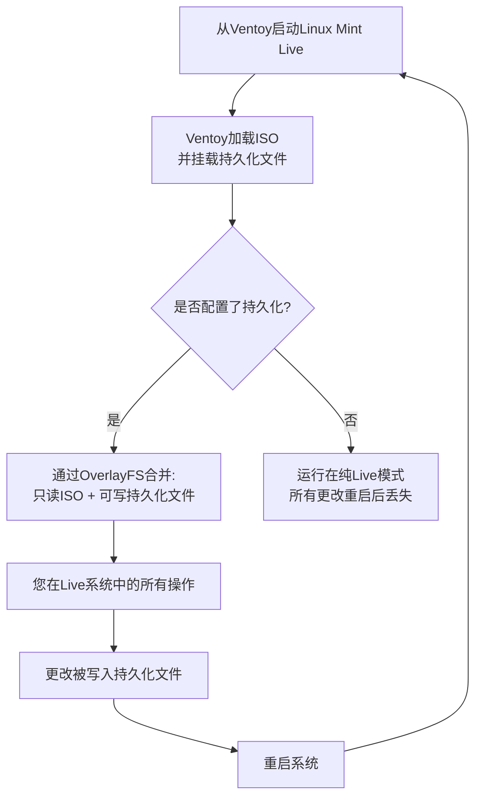

> 背景：淘宝上看到卖linux to go的U盘，商家表示是将系统安装在U盘中，不是用的linux live+持久化。Linux mint是最容易上手的Linux系统，准备制作一个Linux mint to go。没有想到踩了很多坑。

> 坑一：U盘的选择和电脑U盘接口的选择。如果想获得流畅的使用效果，U盘需要选择支持3.0以上协议，并且4K（小文件）读写能力强的U盘。知乎上有U盘的评测，此处不再引用。如果没有找到可以留言。
>
> 坑二：建议选择虚拟机安装法，不要选择使用物理机直接安装（两个U盘，一个Rufus制作启动盘，安装到另一U盘）。一是容易磁盘选择错误，装在当前电脑的主硬盘。二是容易出现引导错误，导致Linux to go无法引导，或者当前电脑的windows系统无法引导（俗称炸引导）
>
> 坑三：通过物理机直接安装ubunto/xubunto to go可以成功。但是安装Linux mint to go无法成功，不知道是否是mint的支持问题。
>
> 坑四：目前还没有成功的：制作 Legacy BIOS / EFI 双启动的 Ubuntu To Go 启动盘。网上的教程有限，不敢轻易尝试。

在踩了几个坑之后，详细询问了deepseek。以下为deepseek的总结回答：

> #### 问题：ventoy持久化分区的方案，实际上是用的linux live模式+持久化数据存储的方案吗？每次打开Linux mint live都是一个全新的系统，如果已经设置了持久化分区，通过live模式使用，在live模式下安装了软件，下次再次打开镜像的时候，上一次安装的软件还在吗？

是的，您的理解非常准确。Ventoy的持久化方案，其核心确实是 Linux Live 模式 + 持久化数据存储。下面我为您详细解释一下它的工作原理和效果。

### 💾 Ventoy持久化的工作原理
Ventoy的持久化功能并非特立独行，它巧妙地利用了许多Linux Live系统（包括Linux Mint）原生支持的持久化技术，但提供了一种更灵活的实现方式：

#### 传统的持久化：
通常需要在一个独立的物理分区上创建持久化存储空间（通常命名为casper-rw或persistence）。这个分区专门用于保存对Live系统所做的更改。

#### Ventoy的方案：
Ventoy无需单独分区。它通过在U盘的数据分区上创建一个特殊的磁盘镜像文件（例如一个名为 persistence.dat 的文件）来模拟这个持久化分区。这个文件在启动时会被视为一个独立的设备挂载到Live系统中。

其背后的关键技术是 OverlayFS（叠加文件系统）。您可以把它想象成两层：

- 下层（只读）：原始的、未被更改的Linux Mint ISO文件内容。

- 上层（可写）：Ventoy创建的持久化数据文件。

当您在Live模式下操作时，所有对系统的更改（例如安装软件、保存文件、修改设置）都会被重定向并写入到这个上层的持久化文件中。原始的系统镜像始终保持不变。

#### 为了更直观地理解这个过程，您可以参考以下的工作流程图：

### 🔄 重启后，软件和设置还在吗？
只要您正确配置了持久化存储，是的，您上次安装的软件、修改的系统设置以及保存在Home目录下的文件，在下次启动时都会完好无损地出现。

这是因为系统重启后，Ventoy会再次将同一个持久化数据文件挂载起来，OverlayFS会将它之前保存的所有变更重新叠加到干净的Live系统之上，从而完美恢复到您上次使用时的状态。

为了清晰地了解配置持久化前后的巨大差异，您可以参考下表：

| 操作场景	| 持久化配置	| 安装的软件	| 系统设置 & 文件	|备注 |
|  ----  | ----  |----  |----  |----  |
| 默认Live模式	| 未配置	| ❌ 重启后丢失	| ❌ 重启后丢失	| 就是一个标准的、每次都很干净的体验盘。|
| 使用Ventoy持久化	| 已配置	| ✅ 保留	| ✅ 保留	| 实现了您想要的 Linux To Go 效果。|

### 🔧 如何为Linux Mint设置持久化
您可以参考以下简要步骤，具体的操作命令和配置方法，Ventoy官方文档提供了详细的说明：

安装Ventoy：首先在您的U盘上安装Ventoy。

放入镜像：将Linux Mint的ISO文件拷贝到U盘中。

创建持久化文件：使用Ventoy提供的 CreatePersistentImg.sh 脚本，在U盘中创建一个持久化数据文件（例如 mint_persistence.dat）。在创建时，您需要为Linux Mint系统指定正确的文件系统标签（Label），根据官网信息，Linux Mint应使用 casper-rw。

创建配置文件：在U盘的特定位置（通常是第一个分区下的 ventoy 目录）创建或编辑 ventoy.json 配置文件，将Linux Mint的ISO文件与你刚创建的持久化数据文件关联起来。

完成这些步骤后，当您从Ventoy启动这个Linux Mint镜像时，它就会自动启用持久化功能了。
_________

> #### 问题：如果我不想用这种live模式+持久化分区的模式，而是真正地将Linux mint安装到U盘中，作为真正地Linux to go来使用，应该使用什么软件来制作成功率最高？当前使用的windows电脑是传统模式启动还是uefi的模式启动，对于制作的Linux to go有什么影响吗？还有哪些需要注意到问题？

想将Linux Mint完整地安装到U盘中，制作一个真正的、能随身携带的Linux系统，这个想法很棒。针对你的问题，我为你梳理了一套成功率高且详细的方案。

首先，为了让你对两种主流的制作方法有个快速的概览，我准备了一个对比表格：

|特性对比	|虚拟机安装法（推荐）	|物理机直接安装法|
|  ----  | ----  |----  |
|成功率	|⭐⭐⭐⭐⭐ 极高	|⭐⭐⭐ 依赖硬件兼容性|
|安全性	|⭐⭐⭐⭐⭐ 不触及主机系统|	⭐⭐ 有误选硬盘风险|
|兼容性	|⭐⭐⭐⭐⭐ 易于统一配置	|⭐⭐⭐ 受当前电脑硬件影响|

核心原理	在虚拟机中将U盘作为唯一硬盘进行安装	从启动U盘启动，在实体环境中安装到另一个U盘
所需工具	VMware Workstation / VirtualBox	Linux Mint启动盘
### 💻 制作真正的Linux To Go
在表格中提到的两种方法里，我强烈推荐使用虚拟机方案，因为它能最大程度地避免误操作和硬件兼容性问题。

### 🔧 推荐方案：使用虚拟机安装（成功率最高）
这种方法的核心是在虚拟机环境中，将你的U盘模拟为虚拟机的唯一硬盘，然后像给普通电脑装系统一样，把Linux Mint安装到这块“硬盘”（即你的U盘）上。

#### 详细步骤如下：

##### 准备工作

U盘：准备一个高速USB 3.0及以上的U盘或移动硬盘，容量建议至少64GB。系统本身会占用约20-30GB，剩余空间用于安装软件和存储文件。

##### 软件：

下载 Linux Mint 的ISO镜像文件。

安装 VMware Workstation 或 Oracle VirtualBox（以VMware为例）。

##### 关键设置步骤

创建虚拟机：新建虚拟机，选择Linux系统类型，例如"Ubuntu 64位"。

载入镜像：在虚拟机设置中，将Linux Mint的ISO文件指定给虚拟机的光驱。

##### 挂载U盘（最关键的一步）：

在虚拟机设置中，移除虚拟机自带的虚拟硬盘。

- 点击"添加"，选择"硬盘"->"SCSI"->"使用物理磁盘"。

- 在"设备"下拉菜单中，务必准确选择对应你U盘的PhysicalDriveX（例如PhysicalDrive1, PhysicalDrive2）。你可以在Windows的"磁盘管理"中根据容量确认U盘的编号，操作错误可能导致主机系统数据丢失。

- 选择"使用整个磁盘"。

- 开启虚拟机并安装：启动虚拟机，它会从你指定的ISO镜像引导。之后的安装流程与在普通电脑上安装Linux Mint完全相同。

### ⚠️ 备选方案：物理机直接安装
此方法需要你先用Rufus等工具制作一个Linux Mint的启动U盘，然后用这个启动盘引导电脑，在安装过程中，在选择安装位置的步骤时，务必选择你的目标U盘（即要制作成Linux To Go的U盘）。

#### 此方法有两大主要风险：

- 选错磁盘：在分区界面，一旦不小心将系统安装到电脑的主硬盘，会导致主机系统数据丢失。

- 引导程序安装位置错误：安装程序的引导程序（GRUB）可能会覆盖主机硬盘的引导记录，导致主机系统无法启动。

如果坚持使用此方法，请务必在分区时确认你选择的是U盘对应的设备（如/dev/sdb），并谨慎选择引导程序的安装位置，通常应将其安装到U盘自身的EFI分区。

### 🔄 启动模式的影响与选择
你当前Windows电脑的启动模式，对于制作的Linux To Go的兼容性有直接影响。

- UEFI模式：这是现代电脑的标准。在此模式下制作的Linux To Go，通常只能在支持UEFI启动的电脑上使用。安装时，U盘上会自动创建一个EFI系统分区（ESP），用于存储引导文件。

- 传统BIOS（Legacy）模式：在此模式下制作的系统，通常只能在以传统模式启动的老旧电脑上使用。

#### 最佳实践建议：

为了让你制作的Linux To Go能在尽可能多的电脑上启动，最稳妥的方法是制作同时兼容UEFI和传统BIOS的启动盘。这在采用上述虚拟机安装法时很容易实现：只需在虚拟机设置的"启动"或"固件"类型中，明确选择"UEFI"。这样安装程序就会自动创建正确的ESP分区，生成的系统将主要支持UEFI启动，同时兼容性也更好。

### 📝 注意事项
硬件性能是关键：U盘的读写速度直接决定了整个系统的运行流畅度。一个低速U盘会让系统变得异常卡顿。因此，务必使用高速固态U盘或移动硬盘。

处理驱动兼容性：Linux To Go需要在不同硬件配置的电脑上启动，可能会遇到显卡、无线网卡等驱动问题。最好在制作时，就预先安装好通用的显卡驱动和常见的无线网卡驱动。

##### 保护数据与设备：

随时备份：将重要数据同步到云盘或另一个移动设备上，避免U盘丢失或损坏导致数据丢失。

安全弹出：在任何电脑上使用完毕后，都务必通过系统"安全删除硬件"的功能弹出U盘，防止数据损坏。

希望这份详细的指南能帮助你成功制作出属于自己的Linux To Go！

引用：  
https://zhuanlan.zhihu.com/p/27871019  
https://blog.csdn.net/qq_45366830/article/details/129612844  
https://zhuanlan.zhihu.com/p/193926222  
https://www.luogu.com/article/lhccdt2t  

